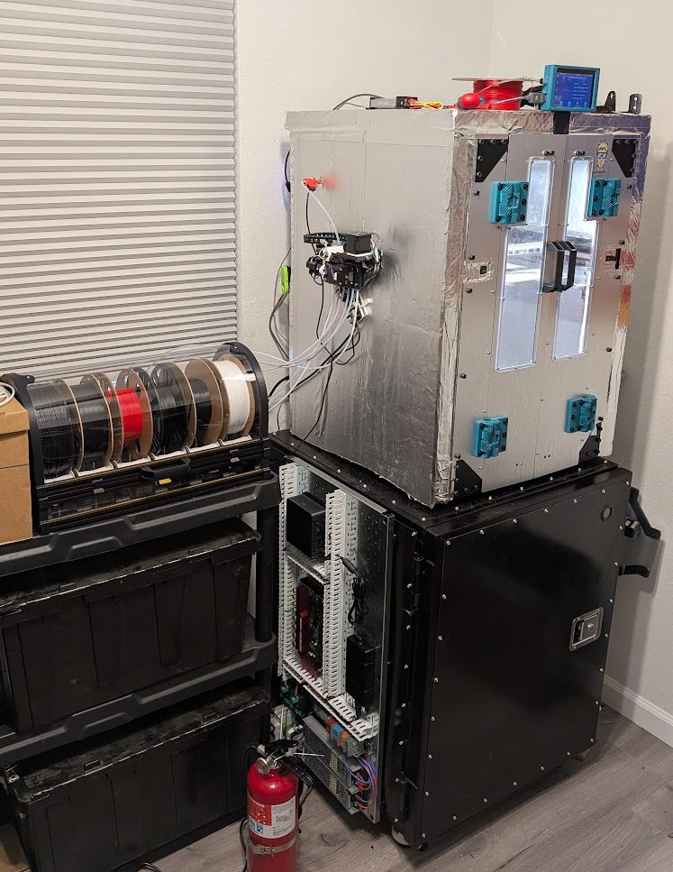
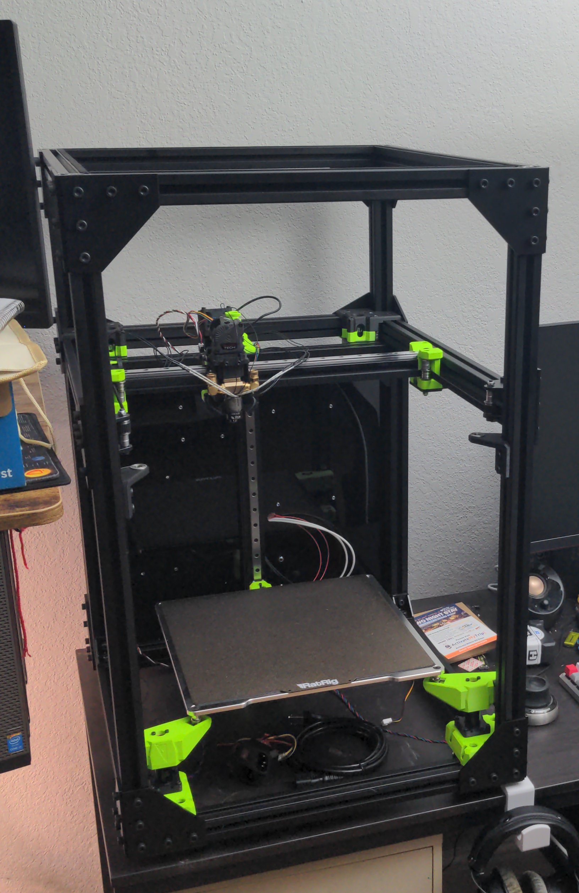
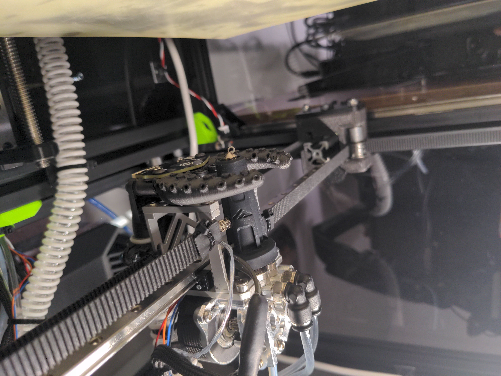
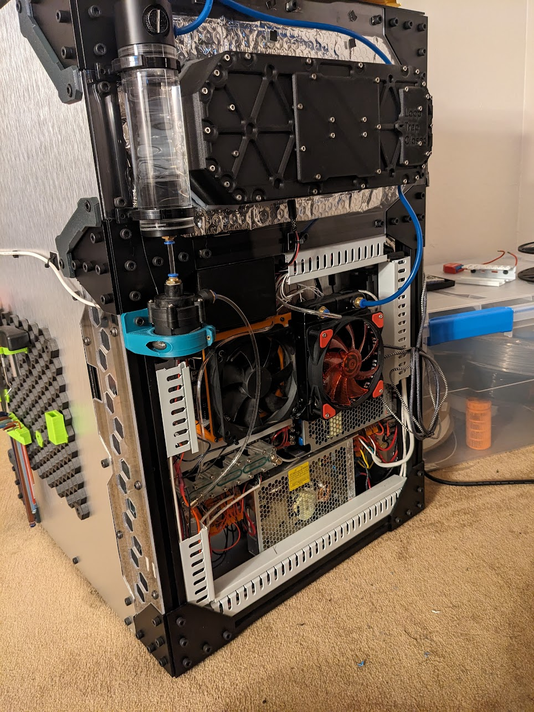
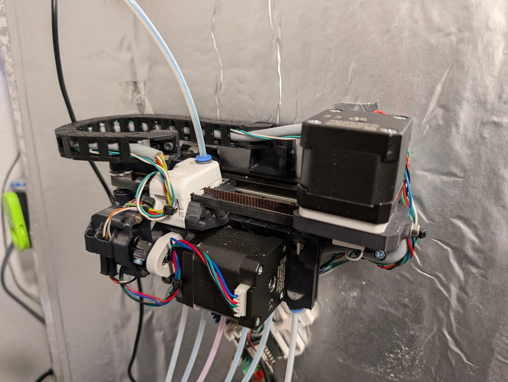

# Modified 3D Printer

This is an ongoing personal project with the goal of having a reliable, fast FDM 3D printer suitable for any other personal projects. I plan to update this page as more modifications are made. 

## Table of Contents

1. [Current Specs](#current-specs)
2. [The Original Printer](#the-original-printer)
3. [Early Modifications](#early-modifications)
4. [Adding Capability](#adding-capability)
5. [In Progress and Future Plans](#in-progress-and-future-plans)

## Current Specs

* 300mm x 300mm x 300mm build volume
* [Kalico](https://github.com/KalicoCrew/kalico) (Klipper fork) firmware
* 500&deg;C hotend
* 120&deg;C bed
* 80&deg;C chamber
* 6-spool multi-material filament changer
* Eddy current bed probe (Beacon3d)

## The Original Printer

I started off with a kit build of a RatRig VCore 3.1. I chose this over other options because of the sturdy frame
made from 3030 extrusions, the 3-point kinematic bed mounts, and simple, but fast CoreXY motion system.

## Early Modifications

There were a couple of modifications I made very quickly after assembling the printer. I made enclosure panels from Polycarbonate sheet,
which helped keep the chamber temperature above ambient to allow printing materials such as ASA. 

I also changed some of the PETG 3D printed components out with aluminum versions. These components included the bed mounts and toolhead. 
This allowed for a light weight and yet sturdy construction. In addition, I was worried these parts would start to warp in a heated chamber.

In order to achieve high print speeds, I installed a high-flow hotend and cooled the extruder and cold side of the filament path using a water cooling loop. Part cooling was achieved through a remote blower fan and flexible duct.

All of the electronics were mounted to the rear of the printer. 

## Adding Capability

After using the printer as-is for some months, I decided to add some more capability to enhance the printer. I replaced the enclosure panels with PIR insulation to allow the chamber to reach higher temperatures. This helps the printer easily print ASA with little to no warp or adhesion issues, and allows for more "engineering" polymers to be printed: PC, PPS, PPA, and similar.

I also added a 6-spool multi-material filament changer, which allows for multi-color prints, and makes swapping spools easier and more automated.

## In Progress and Future Plans

Here are the modifications that I am working on currently or have planned for the future:

* Active chamber heating. I plan to use a PTC heater and fans to more rapidly and consistently heat up the print chamber.
* Re-wiring. I am rewiring the printer using more professional terminal blocks and wire channels. This will help with serviceability.
* Filament cutter. The N in 1 out filament switcher is not currently reliable because the tip of the filament becomes a blob or string when retracting. A cutter on the toolhead would increase reliability by eliminating that aspect.
