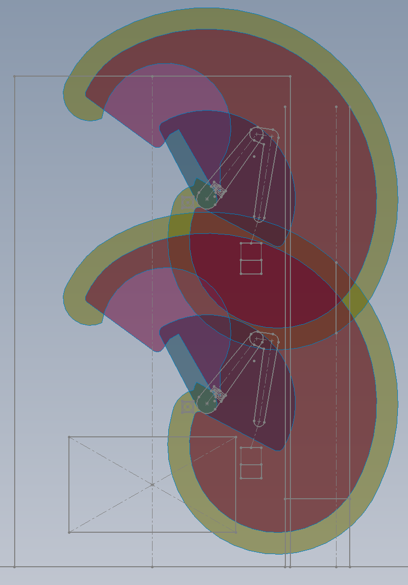
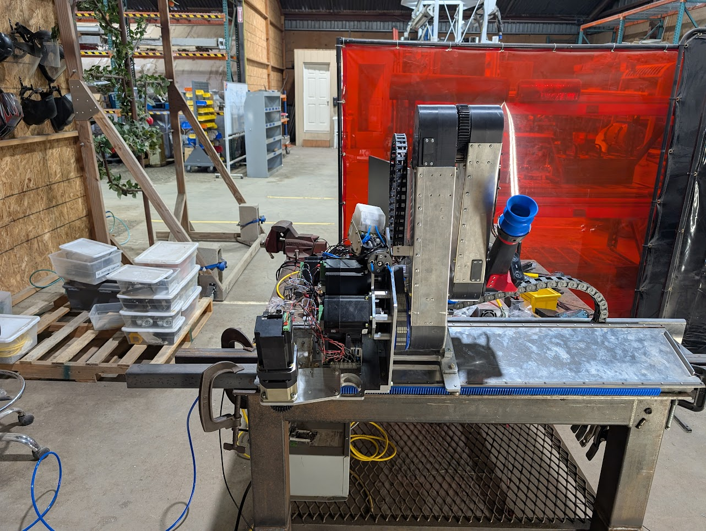
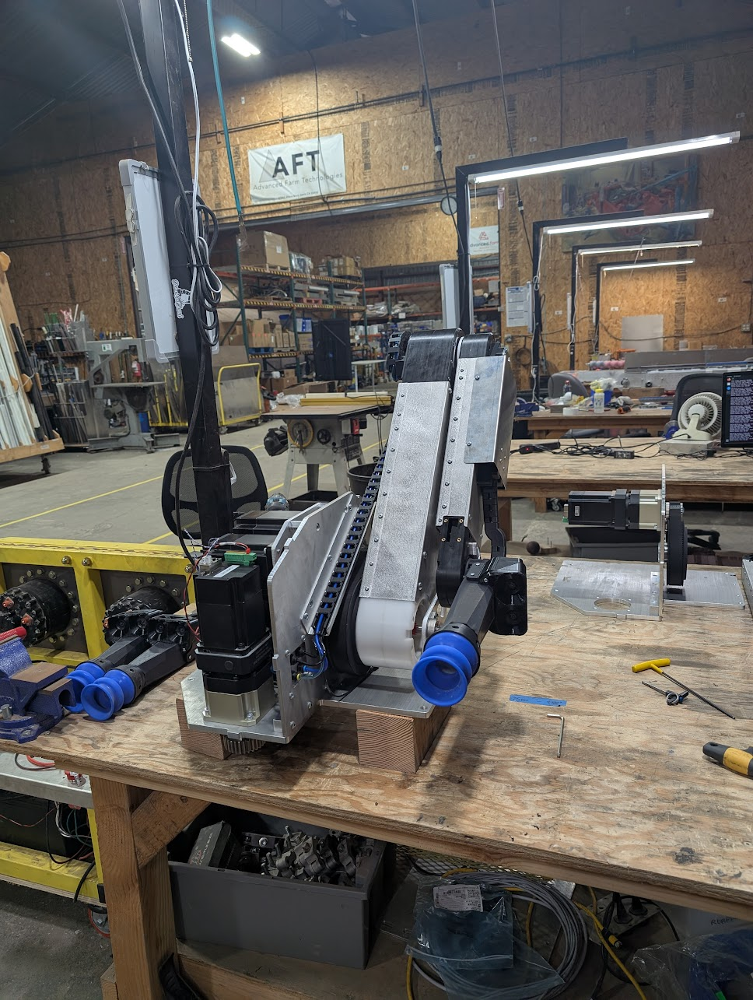

# 4-DOF Robot Arm

## Table of Contents

1. [Project Goal](#project-goal)
2. [Analysis](#analysis)
3. [Physical Concept](#physical-concept)
4. [Development Prototype](#development-prototype)
5. [Alpha Prototype](#alpha-prototype)

## Project Goal

In my last 6 months at Advanced Farm, I worked on designing and prototyping a robot arm to replace the T-bot kinematic 
we were using on our apple harvester. The goal was to address the following problems with the T-bot:

* Serviceability. The T-bot was difficult to replace or service in the field; we needed an option that would be more quickly swappable.
* Work volume. The T-bot had limited vertical reach.
* Robot density. We needed to fit double the robots in a similar volume without too much robot-robot interference.

## Analysis

The first step in the design process was to perform range-of-motion analysis and estimate the required motor specs. To do this, I started with some basic SolidWorks sketches to figure out linkage lengths and joint ranges of motion. 

When I was satisfied with what looked reasonable, I built a URDF file with some simplified mesh files and loaded it into CoppeliaSim. The simulation tools allowed me to get speed and torque graphs representative of actual robot movement during apple pick and drop cycles. This was checked against real-world T-bot data to verify that the results were reasonable.

## Physical Concept

This step was a sprint; full 3D design, fabrication, and assembly were completed in about 2.5 weeks for the first physical concept model. The construction was mostly 3D printed, including spur gears and timing pulleys. After mechanical assembly was complete, the software team got it running and were able to run some simulated pick cycles before one of the 3D printed gears stripped its teeth.

This version of the robot was only 3-DOF. The gantry axis was left out to make the scope more manageable.

## Development Prototype

Over the next month, I took all the lessons I had learned so far, and designed a version of the robot that was intended to be used by the software team for development. This version did have the gantry axis, and took into consideration DFM and DFA.

This robot was left running simulated pick cycles for two weeks during the 2024 Christmas and New Years holidays. There were a couple of problems encountered, but overall the robot achieved over 500,000 cycles to test its reliability.

## Alpha Prototype

This is the first version of the robot that was intended to be installed on the harvester. It fixed the reliability and assembly issues that the development prototype had, and took into consideration some of the things that were afterthoughts on the previous versions, such as cable management and ingress protection.
