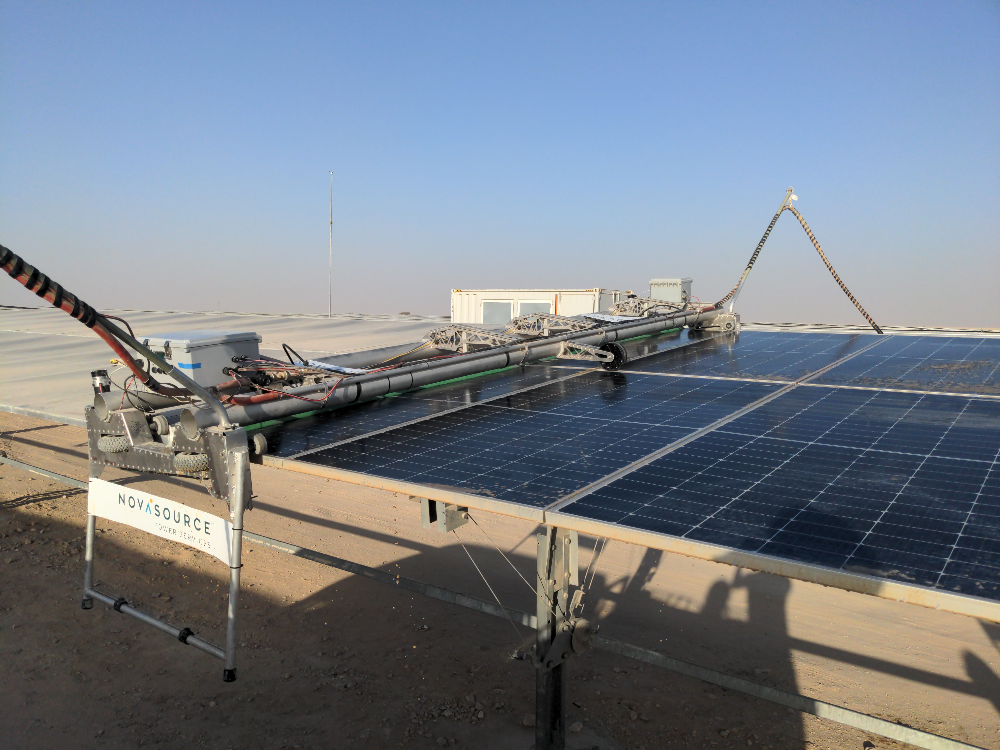

# Solar Panel Cleaning Robot

## Table of Contents

1. [About the Project](#about-the-project)
2. [Design Elements](#design-elements)
3. [Production and Deployment](#production-and-deployment)

## About the Project

While working at NovaSource Power Services, I worked as the lead designer on a 4-meter-wide solar panel cleaning robot. The goal was to create cost-effective robots for the purpose of cleaning solar power plants using 4-meter-wide trackers. In order to be competitive, the robot systems needed to be operable with a minimum number of human operators, and be water efficient.

## Design Elements

In order to accomplish the project goals, we created a new design based on earlier models we had used for different tracker types. Below are some of the design elements we implemented:

* Off-board power and water. By tethering the robots to a support truck, we could keep the chassis lighter and simpler than having on-board power and water.
* Two-man lift. Each robot was light enough to be team lifted by two operators and placed on the solar panels.
* Daisy-chainable. A total of 6 robots were able to be connected to one support truck, allowing for maximum panel coverage with each pass.
* Serviceable. All components needed to be replaceable by a technician with ease.

## Production and Deployment

In the summer of 2021, we started producing 5 fleets of these robot systems (30 total robots) for an international customer. Many of the parts were made in-house, and underwent a rigorous testing procedure and commissioning to ensure full functionality.

In the fall of 2021 and winter of 2022, we set up the fleets and trained operators for the customer. This was a large site, about 4 square miles of solar panels.
